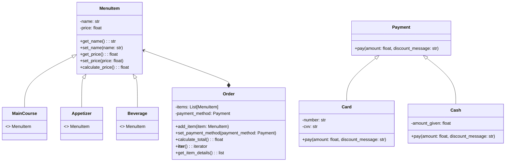

# The-looping-restaurant
***

### Better Comments
_This is the how I decided to use the extension._
- #Info related to the program (grey)
- #* Titles (green light)
- #? Advices or clarifications (blue)
- #todo Need to reforce (orange)
- #! Confused bout' something (red)
- #// Discarted (--)
- #- Success (yellow)
***

## 2. Dante's Inferno
I wanted to create a restaurant named after my dog, Dante. The menu is inspired by my personal preferences and pricing experiences. I had to devise strategies to make the code more concrete. In this opportunity, I found it a little bit harder to implement the private and protected stuff when adding the payment methods.

```python

#* Restarurant - Dante's Inferno
# I am going to create a program that allows the customer to know how much money they have to pay.

class MenuItem:
    def __init__(self, name, price):
        self._name = name
        self._price = price

    def get_name(self):
        return self._name

    def set_name(self, name):
        self._name = name

    def get_price(self):
        return self._price

    def set_price(self, price):
        self._price = price

    def calculate_price(self):
        return self._price


class MainCourse(MenuItem):
    pass


class Appetizer(MenuItem):
    pass


class Beverage(MenuItem):
    pass


class Order(MenuItem):
    def __init__(self):
        self.items = []
        self.payment_method = None

    def add_item(self, item):
        self.items.append(item)

    def set_payment_method(self, payment_method):
        self.payment_method = payment_method

    def calculate_total(self):
        #? Define discount items and their corresponding discount percentages
        hot_discount_items = ["Hot wings", "Mini nachos", "Coke"]
        la_discount_items = ["Tacos de birria", "Mini empanadas", "Peach Tea"]
        ita_discount_items = ["Pepperoni slice pizza", "French bread", "Coconut lemonade"]
        thirsty_discount_items = ["Coconut lemonade", "Coke", "Mango juice", "Peach Tea"]

        hot_discount = 0.05
        la_discount = 0.03
        ita_discount = 0.06
        thirsty_discount = 0.07

        total_price = sum(item.calculate_price() for item in self.items)

        item_names = [item.get_name() for item in self.items]

        discount = 0
        discount_message = "You did not get a discount for this purchase"

        #? Check if all items in the order match the discount items
        if all(item in item_names for item in hot_discount_items):
            discount = total_price * hot_discount
            discount_message = "5% Hot discount applied."
        elif all(item in item_names for item in la_discount_items):
            discount = total_price * la_discount
            discount_message = "3% La discount applied."
        elif all(item in item_names for item in ita_discount_items):
            discount = total_price * ita_discount
            discount_message = "6% Ita discount applied."
        elif all(item in item_names for item in thirsty_discount_items):
            discount = total_price * thirsty_discount
            discount_message = "7% Thirsty discount applied."

        total_price -= discount

        if self.payment_method:
            self.payment_method.pay(total_price, discount_message)

        return total_price, discount_message


# Payment classes
class Payment:
    def __init__(self):
        pass

    def pay(self, amount, discount_message):
        raise NotImplementedError("Subclasses must implement pay()")


class Card(Payment):
    def __init__(self, number, cvv):
        super().__init__()
        self.number = number
        self.cvv = cvv

    def pay(self, amount, discount_message):
        print(f"Processing payment of ${amount} with card ending in {self.number[-4:]}")
        print(f"Discount: {discount_message}")


class Cash(Payment):
    def __init__(self, amount_given):
        super().__init__()
        self.amount_given = amount_given

    def pay(self, amount, discount_message):
        if self.amount_given >= amount:
            print(f"Payment completed in cash. Change: ${self.amount_given - amount}") #? This is the change that the customer will receive.
            print(f"Discount: {discount_message}")
        else:
            print(f"Insufficient funds. ${amount - self.amount_given} needed to complete the payment.") 
            #? This is the amount of money that the customer needs to complete the payment.


# Define menu items
menu = [
    MainCourse("Pepperoni slice pizza", 7000),
    MainCourse("Hot wings", 15000),
    MainCourse("Tacos de birria", 15000),
    Appetizer("French bread", 4000),
    Appetizer("Mini nachos", 12000),
    Appetizer("Mini empanadas", 8000),
    Beverage("Coconut lemonade", 8000),
    Beverage("Coke", 6000),
    Beverage("Mango juice", 7000),
    Beverage("Peach Tea", 6000),
]

def display_menu():
    print("\nMenu:")
    for i, item in enumerate(menu, start=1):
        if isinstance(item, MainCourse):
            category = "Main Course"
        elif isinstance(item, Appetizer):
            category = "Appetizer"
        elif isinstance(item, Beverage):
            category = "Beverage"
        else:
            category = "Unknown"
        print(f"{i}. {item.get_name()} - ${item.get_price()} ({category})")

def get_order():
    order = Order()
    display_menu()

    while True:
        choice = input("\nEnter the number of the item you'd like to order (or 'q' to finish): ") 
        #? This is the input that the customer will use to choose the items.
        if choice.lower() == 'q':
            break
        try: #? This was suggested by Copilot to handle the exceptions.
            choice_idx = int(choice) - 1
            if choice_idx < 0 or choice_idx >= len(menu):
                raise ValueError
            order.add_item(menu[choice_idx])
        except (ValueError, IndexError):
            print("\nInvalid choice. Please try again.")

    total_price, discount_message = order.calculate_total()
    print(f"\nTotal amount to pay: ${total_price}\n\nDiscount: {discount_message}")

    payment_choice = input("\nChoose payment method (1. Card, 2. Cash): ")
    if payment_choice == "1":
        card_number = input("Enter card number: ")
        cvv = input("Enter CVV: ")
        order.set_payment_method(Card(card_number, cvv))
    elif payment_choice == "2":
        amount_given = float(input("Enter amount given: "))
        order.set_payment_method(Cash(amount_given))
    else:
        print("Invalid payment method. Payment not completed.")

    return order

print("Welcome to Dante's Inferno!")
order = get_order()
total, discount_message = order.calculate_total()
print("Have a bloody good day!")
class Order:
    def __init__(self):
        self._items = []

    def add_item(self, item):
        if isinstance(item, MenuItem):
            self._items.append(item)
        else:
            raise ValueError("Item must be of type MenuItem")

    # Making the class iterable
    def __iter__(self):
        return iter(self._items)

    # Allowing access to individual item attributes (e.g., name and price)
    def get_item_details(self):
        details = []
        for item in self._items:
            details.append({
                'name': item.get_name(),
                'price': item.get_price()
            })
        return details
    
```

Discounts:
Hot discount - When ordering hot wings, mini nachos and Coke, the order will have a 5% total discount.
La discount - When ordering tacos de birria, mini empanadas and peach tea, the order will have a 3% total discount.
Ita discount - When ordering pepperoni pizza, French bread and coconut lemonade, the order will have a 6% total discount.
Thirsty discount - When ordering coconut lemonade, coke, mango juice and peach tea.

# Mermaid - Dante's inferno
***

